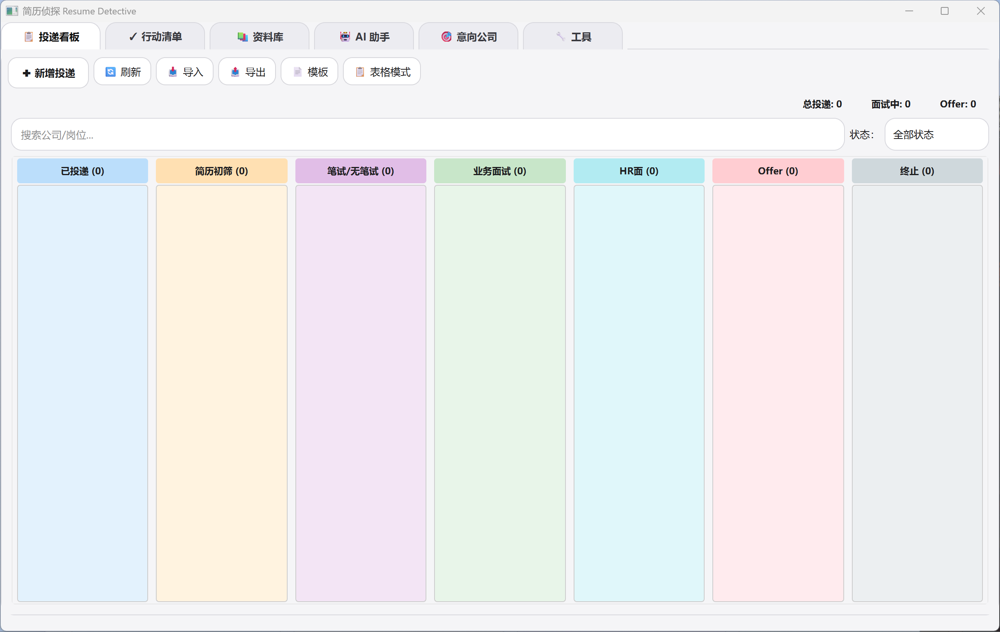
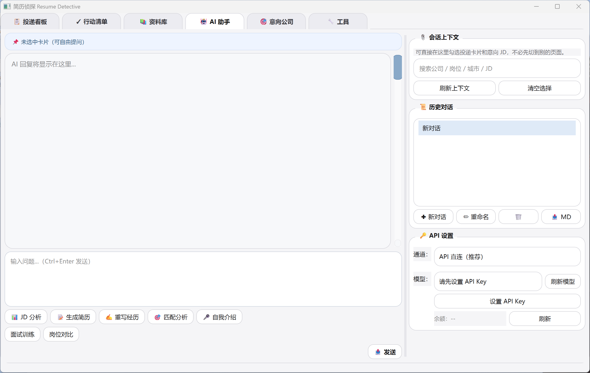
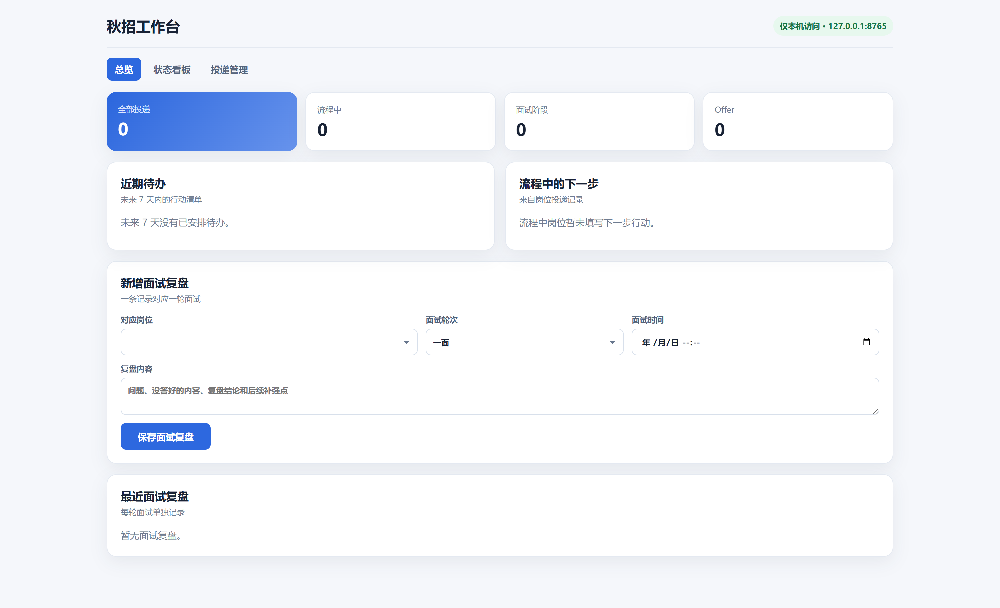
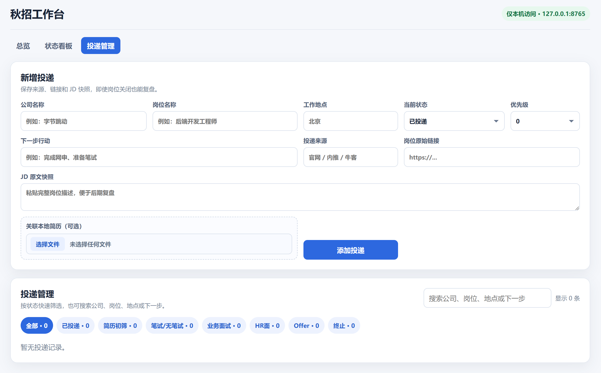

<div align="center">

# 📋 Resume Detective

**本地优先的求职工作台** — 投递追踪 / 行动清单 / 意向公司 / 资料库 / AI 辅助，一站式搞定


---

</div>

## 📌 简介

Resume Detective 是一个**本地优先**的求职管理工具，帮助你在秋招/社招中管理岗位、投递、待办、面试复盘和求职素材。它同时提供 Windows 桌面端与 localhost 网页工作台；核心数据存储在本地 SQLite，不联网也能使用投递追踪等核心功能。

当前公开版本：**v3.0.0**。

### 它能做什么？

- 📋 **投递看板** — 拖拽切换状态，一目了然所有投递进度
- 🗂️ **意向公司** — 收集目标公司与 JD，一键转为投递记录
- 📚 **资料库** — 维护个人简历素材，生成简历初稿
- ✓ **行动清单** — 集中管理笔试、面试准备、跟进与截止日期
- 🤖 **AI 助手** — JD 分析、匹配度评估、简历重写
- 🛠️ **小工具** — PDF ⇄ 图片转换、Excel 导入导出
- 🌐 **本地浏览器工作台** — 默认访问 `http://127.0.0.1:8765`，提供总览、看板/表格、投递管理、面试复盘与简历汇总
- 📊 **固定 Excel 镜像** — 每次修改投递记录自动更新个人数据目录中的 `秋招投递追踪.xlsx`

## ✨ 功能特性

| 模块 | 特性 | 说明 |
|------|------|------|
| 📋 **投递看板** | 🎯 泳道视图 | 7 个投递阶段（已投递→筛选→笔试→面试→Offer），支持拖拽切换 |
| | 📊 表格视图 | 高密度列表，支持搜索过滤与列排序 |
| | 📎 附件管理 | 每份投递可添加简历/作品/反馈附件，删除自动进回收站 |
| | 🏙️ 城市字段 | 记录目标城市，看板卡片 tooltip 实时展示 |
| 🎯 **意向公司** | 📋 目标池 | 维护目标公司与岗位 JD，支持优先级标记 |
| | 🔄 一键转投递 | 分析完成直接转为投递记录 |
| ✓ **行动清单** | ⏰ 截止日期 | 记录笔试、面试、跟进等行动，自动标出今日与逾期事项 |
| | 🔗 岗位关联 | 可关联投递卡片或意向岗位，支持优先级、完成状态和排序 |
| 📚 **资料库** | 👤 个人信息 | 姓名/学校/专业/技能/目标城市等，AI 生成时自动引用 |
| | 📝 经历碎片 | 项目/竞赛/实习经历，支持标签分类，随时调用 |
| 🤖 **AI 助手** | 🔗 API 直连 | 支持 DeepSeek API，Key 本地加密保存（DPAPI） |
| | ⚙️ Reasonix CLI | 可选接入 [DeepSeek-Reasonix](https://github.com/esengine/DeepSeek-Reasonix)，失败时可回退到 API 直连 |
| | 🧩 5 个业务按钮 | JD 分析 / 匹配分析 / 简历初稿 / 重写经历 / 自我介绍，一键生成草稿 |
| | 🗣️ 自由对话 | 直接提问，上下文关联投递卡片或意向公司 |
| 🛠️ **工具** | 📄 PDF → 图片 | 将 PDF 每页导出为图片（可选项） |
| | 🖼️ 图片 → PDF | 图片合成为图片版 PDF |
| | 📊 Excel 导入 | 批量导入投递记录 |
| 🌐 **本地看板** | 浏览器访问 | 默认监听 `127.0.0.1:8765`，可在软件「工具」页调整端口，始终不对局域网开放 |
| | Excel 镜像 | 个人数据目录中的 `秋招投递追踪.xlsx` 自动同步，软件为唯一写入源 |

## 📌 秋招追踪的日常使用

程序启动后，会生成或更新个人数据目录中的 `秋招投递追踪.xlsx`。在软件内新增、修改、拖动或删除投递记录后，工作簿会自动同步；Excel 适合查阅、筛选、统计和备份，请不要把它作为回写入口。

如果想在浏览器中操作而不切回桌面窗口，可以保持 Resume Detective 运行，然后打开默认地址：

```text
http://127.0.0.1:8765
```

该地址只允许本机访问。网页端分为五个页面：

- **总览**：聚焦投递统计、近 7 天待办和流程中的下一步，并提供各工作区快捷入口；
- **状态看板**：流程中岗位保留在限高泳道，终止岗位收进底部折叠归档；切到高密度表格后可按需显示终止岗位，并支持状态更新时间与关键词搜索；
- **投递管理**：以紧凑表格搜索、筛选岗位，点击时只展开一条编辑面板；终止岗位进入独立归档区并可恢复跟踪；
- **面试复盘**：独立新增和检索每轮面试记录，历史记录按岗位分组折叠，已终止岗位的复盘仍会保留；
- **简历汇总**：当前岗位与历史岗位分区展示，集中查看绑定版本、文件状态与关联时间，历史关联默认折叠。

每条投递还可以保存「投递来源、岗位原始链接、JD 原文快照」。其中链接用于回访原页面，JD 快照直接保存在本地 SQLite 和 Excel 镜像中，因此岗位下架后仍能用于简历与面试复盘。

网页上传的 PDF、DOC、DOCX 简历会复制到个人数据目录的 `Resumes`；删除投递时，关联简历与附件会移入系统回收站。端口可在「🔧 工具 → 🌐 网页看板设置」中修改，保存后立即生效。

也可以直接双击 `启动网页看板.bat`：它只启动网页网关，不启动桌面窗口，并自动打开浏览器。关闭该脚本窗口或按 `Ctrl+C` 即停止网关。

## 🖥️ 界面截图

下面精选 4 张界面图；点击图片可查看原图。其余页面截图保存在 `screenshots/` 目录，可用于 Release Notes 或产品介绍。

<table>
  <tr>
    <td width="50%"><strong>桌面端 · 投递泳道</strong></td>
    <td width="50%"><strong>桌面端 · AI 助手</strong></td>
  </tr>
  <tr>
    <td><a href="screenshots/app-board-kanban.png"></a></td>
    <td><a href="screenshots/app-ai.png"></a></td>
  </tr>
  <tr>
    <td><strong>网页端 · 总览与面试复盘</strong></td>
    <td><strong>网页端 · 投递管理</strong></td>
  </tr>
  <tr>
    <td><a href="screenshots/web-overview.png"></a></td>
    <td><a href="screenshots/web-applications.png"></a></td>
  </tr>
</table>

## 📦 下载

> 前往 [Releases](https://github.com/Suryxin-xx/ResumeDetective/releases) 下载最新版

| 文件 | 说明 |
|------|------|
| `ResumeDetective-v3.0.0-windows-x64.zip` | 桌面端 + 独立网页网关完整包，解压即用（推荐） |

**系统要求：** Windows 10/11，64 位

> ⚠️ 不要只拿走 `ResumeDetective.exe`，请将整个文件夹解压后再运行。
> 首次使用需自行输入 API Key，程序会在本机加密保存。

## 🚀 快速开始

### 普通用户

1. 从 [Releases](https://github.com/Suryxin-xx/ResumeDetective/releases) 下载最新版 zip
2. 解压到任意文件夹
3. 桌面模式：双击运行 `ResumeDetective.exe`
4. 纯网页模式：双击 `启动网页看板.bat`，浏览器访问固定的 localhost 地址
5. 如需 AI 功能，再进入 AI 页面配置 DeepSeek API Key；不配置也不影响投递管理

### 源码运行

适合有 Python 环境的开发者：

```bash
# 1. 克隆仓库
git clone https://github.com/Suryxin-xx/ResumeDetective.git
cd ResumeDetective

# 2. 安装依赖
pip install -r requirements.txt

# 3. 运行
python main.py
```

> Python 版本要求：3.11 及以上

### 个人数据与源码隔离

源码运行时，数据库、简历、Excel、聊天记录、Reasonix 配置和 API Key 默认位于：

```text
%LOCALAPPDATA%\ResumeDetective\Development
```

它们不会写入 Git 仓库。若需自定义位置，可创建被 `.gitignore` 保护的
`.resumedetective.local.json`，格式参考 [data.example/README.md](data.example/README.md)。
打包后的便携版仍使用 EXE 旁的 `data/`，便于整体备份和迁移。

## 🤖 AI 配置

程序支持两种 AI 通道：

| 方式 | 说明 | 配置 |
|------|------|------|
| **API 直连** | ✅ 推荐，配置最简单 | 输入 DeepSeek API Key 即可 |
| **Reasonix CLI** | ⚡ 可选增强模式 | 参考 [esengine/DeepSeek-Reasonix](https://github.com/esengine/DeepSeek-Reasonix)，将 `reasonix.exe` 放入 `Reasonix Cli/` 目录 |

- 源码仓库和发布包都不会内置 API Key 或 Reasonix CLI 二进制
- 用户第一次输入后，Key 使用 Windows DPAPI 加密保存
- Reasonix 需要环境变量时，程序会把已加密保存的 Key 同步到个人数据目录的 `reasonix/.env`，不会写入仓库
- Reasonix CLI 可放入被 Git 忽略的 `Reasonix Cli/`，也可通过 `REASONIX_CLI_PATH` 或本地配置指定
- Reasonix CLI 是可选外部组件；请根据上游项目说明和许可证自行下载、配置与使用

## 🏗️ 技术栈

| 组件 | 用途 |
|------|------|
| [Python](https://www.python.org/) | 编程语言 |
| [PyQt6](https://pypi.org/project/PyQt6/) | GUI 框架 |
| [SQLite](https://www.sqlite.org/) | 本地数据库 |
| [requests](https://pypi.org/project/requests/) | AI API 调用 |
| [openpyxl](https://pypi.org/project/openpyxl/) | Excel 导入导出 |
| [PyMuPDF](https://pypi.org/project/PyMuPDF/) | PDF 处理 |
| [Pillow](https://python-pillow.org/) | 图片处理 |
| [comtypes](https://pypi.org/project/comtypes/) | Windows COM 接口 |
| [PyInstaller](https://pyinstaller.org/) | 打包为 exe |

## 🗂️ 项目结构

```
ResumeDetective/
├── main.py                 # 程序入口
├── gateway_main.py         # 独立网页网关入口
├── local_gateway.py        # localhost 网页工作台
├── excel_sync.py           # 固定 Excel 镜像同步
├── main_window.py          # 主窗口（6 Tab 导航）
├── board_widget.py         # 投递看板（泳道视图 + 卡片拖拽）
├── table_view.py           # 表格视图
├── detail_dialog.py        # 投递详情弹窗（含附件管理）
├── dialogs.py              # 通用对话框
├── materials_widget.py     # 资料库 + 个人信息
├── job_targets_widget.py   # 意向公司管理
├── tasks_widget.py          # 行动清单（截止日期、跟进、面试准备）
├── ai_service.py           # AI 服务（流式 API + 脱敏 + Prompt 组装）
├── cli_ai.py               # Reasonix CLI 适配层
├── db_manager.py           # 数据库管理（7 张表 + 迁移）
├── config_manager.py       # 配置管理
├── secure_store.py         # 加密存储（DPAPI）
├── chat_history.py         # 聊天记录
├── io_export.py            # Excel 导入导出
├── file_ops.py             # 文件操作（回收站、附件）
├── tools_pdf2img.py        # PDF → 图片
├── tools_imgpdf.py         # 图片 → PDF
├── paths.py                # 路径常量
├── requirements.txt        # 源码运行依赖
├── scripts/                # 构建、发布与仓库安全扫描
├── data.example/           # 可公开的数据配置空白模板
├── .githooks/              # 提交前安全检查
├── .github/workflows/      # GitHub 二次安全检查与测试
├── screenshots/            # 截图
└── .resumedetective.local.json  # 本机数据位置（不提交 Git）
```

## 🔐 直接从开发目录提交源码

个人数据已经与源码物理隔离。连接 `.git` 后运行一次：

```powershell
powershell -NoProfile -ExecutionPolicy Bypass -File .\scripts\prepare_existing_repository.ps1
```

该脚本只把 `data/`、`Reasonix Cli/`、构建目录等从 Git 索引移除，不删除磁盘文件，
同时启用提交前安全钩子。每次提交还会阻止数据库、密钥、真实 `.env`、本机绝对路径、
Reasonix EXE、ZIP 和超大文件；GitHub Actions 会再执行同样的检查。

## 🔨 自行打包

```powershell
# 1. 安装依赖
pip install -r requirements.txt
pip install pyinstaller

# 2. 一键生成桌面版 + 独立网关版
powershell -NoProfile -ExecutionPolicy Bypass -File .\scripts\build_exe.ps1
```

最终发布目录位于 `build/release-src/dist/ResumeDetective/`，其中包含桌面版
`ResumeDetective.exe`、独立网页网关 `ResumeDetectiveGateway.exe` 和一键启动脚本
`启动网页看板.bat`。脚本还会自动生成可上传 GitHub Release 的版本化 ZIP 和
对应 SHA-256 文件，不需要再手工复制或压缩目录。

构建脚本会先创建干净源码快照，并自动排除本机数据库、简历、Excel 镜像、
聊天记录、API 密钥、Reasonix CLI/运行缓存和本地调试截图；任何必需源码缺失或安全扫描失败都会直接终止构建。

## 🙏 开发协作与致谢

- 本项目由作者提出需求、确定产品方向并完成验收；开发过程中使用 **ChatGPT / Codex** 与 **DeepSeek** 作为 AI 编程协作工具，参与需求梳理、代码实现、调试、测试和文档整理。最终代码、数据处理方式和发布内容由项目作者审查并负责。
- AI 通道可选集成 [esengine/DeepSeek-Reasonix](https://github.com/esengine/DeepSeek-Reasonix)。感谢该项目提供的 Reasonix CLI 能力与实现参考；Resume Detective 与其并非同一项目，也不代表上游项目对本项目提供官方背书。
- 网页端的信息架构、岗位看板和危险操作交互参考了 [xuuuu-cpu/offerFlow-llm-feature](https://github.com/xuuuu-cpu/offerFlow-llm-feature) 的部分产品思路，并结合本项目的本地优先、SQLite、Excel 镜像和独立网关需求重新实现。
- 所引用外部项目的代码与资源仍受各自许可证约束；使用或分发前请同时阅读对应上游仓库的许可说明。

## 📄 许可证

本项目使用 [MIT License](LICENSE) — 欢迎 fork、修改、分发。

## 🤝 贡献

有问题或建议？欢迎提交 [Issue](https://github.com/Suryxin-xx/ResumeDetective/issues) 或 Pull Request。

---

<div align="center">

**如果这个工具对你有帮助，欢迎 ⭐ Star 支持！**

</div>
