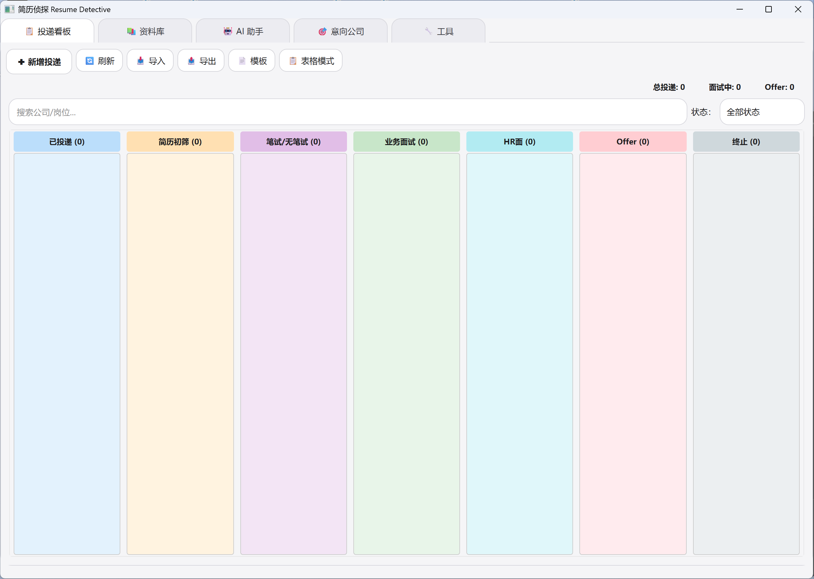
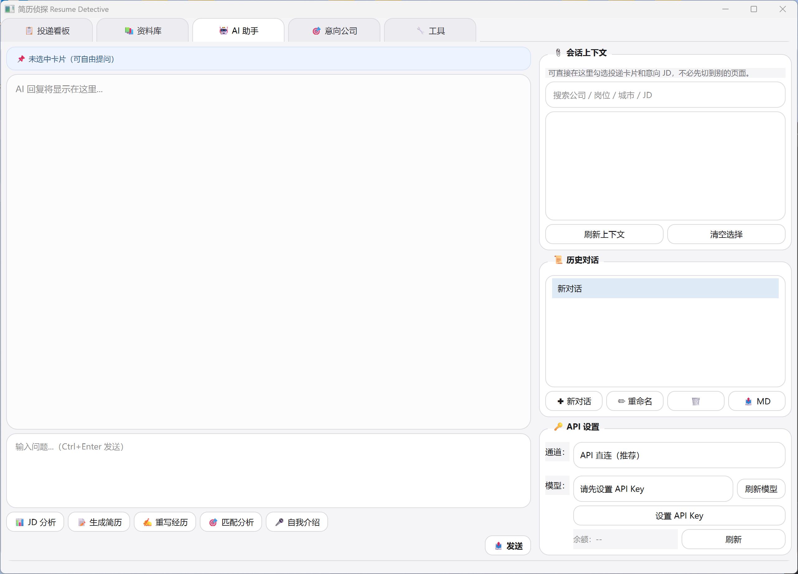

# Resume Detective

本地优先的秋招求职桌面工具，聚焦投递追踪、意向公司管理、资料库整理和 AI 求职辅助。

## 功能概览

- 投递看板：拖拽切换投递状态，快速查看当前进度。
- 表格视图：适合高密度信息浏览、筛选和排序。
- 投递详情：记录 JD、反馈、下一步动作和附件。
- 意向公司：单独维护目标公司与岗位 JD，可一键转为投递。
- 资料库：维护个人信息、经历碎片、项目素材与简历生成材料。
- AI 助手：支持 API 直连与 Reasonix CLI，可做 JD 分析、匹配分析、简历草稿、自我介绍等。
- 工具页：集成 PDF 与图片相关辅助工具。

## 界面截图

截图请放入 [screenshots](E:\Agent\Project\Job\Gadgets\ResumeDetective\screenshots) 文件夹，建议至少准备：

- `board.png`：投递看板
- `materials.png`：资料库
- `ai.png`：AI 助手
- `targets.png`：意向公司

示例引用模板：

```md


```

## 下载与使用

### 普通用户

请从 GitHub Releases 下载打包好的 Windows 版本。

注意：

- 不要只拿走 `ResumeDetective.exe`
- 要把整个发布文件夹完整解压后再运行
- 首次使用时自行输入 API Key，程序会在本地加密保存

### 源码用户

1. 安装 Python 3.11 及以上版本
2. 运行 [install.bat](E:\Agent\Project\Job\Gadgets\ResumeDetective\install.bat)
3. 执行 `python main.py`

## AI 配置

程序支持两种 AI 通道：

- API 直连：推荐，配置最简单
- Reasonix CLI：可选增强模式，只识别程序目录内的 `Reasonix Cli\reasonix.exe`

说明：

- 发布包不会附带开发者自己的 API Key
- 用户第一次输入后，Key 会保存在本机加密存储中
- Reasonix 运行时配置固定在程序自身 `data\reasonix` 目录

## 项目结构

```text
ResumeDetective/
  main.py
  main_window.py
  board_widget.py
  table_view.py
  detail_dialog.py
  dialogs.py
  materials_widget.py
  job_targets_widget.py
  ai_service.py
  cli_ai.py
  db_manager.py
  config_manager.py
  secure_store.py
  chat_history.py
  io_export.py
  file_ops.py
  tools_pdf2img.py
  tools_imgpdf.py
  paths.py
  ResumeDetective.spec
  install.bat
  scripts/
  screenshots/
  data/
```

## 发布说明

推荐采用两层发布：

- GitHub 仓库：上传干净源码副本
- GitHub Releases：上传打包好的 Windows 文件夹压缩包

发布前可运行：

- [build_release.ps1](E:\Agent\Project\Job\Gadgets\ResumeDetective\scripts\build_release.ps1)

这个脚本会生成一份干净的 `build\release-src`，自动排除本机测试数据、聊天记录、数据库和密钥。

## 技术栈

- Python
- PyQt6
- SQLite
- requests
- openpyxl
- PyMuPDF
- Pillow
- comtypes

## License

MIT
