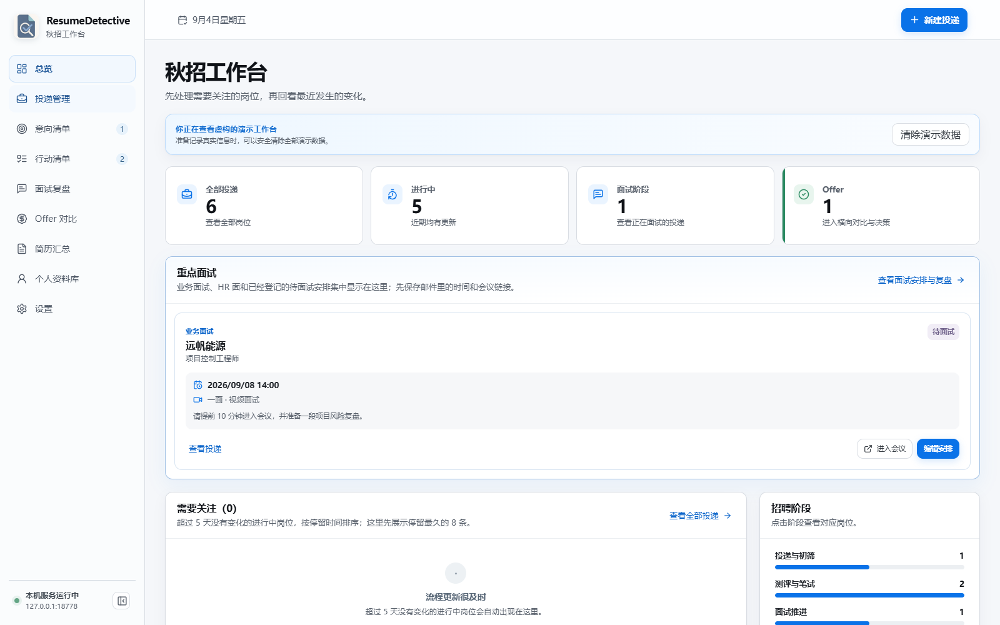
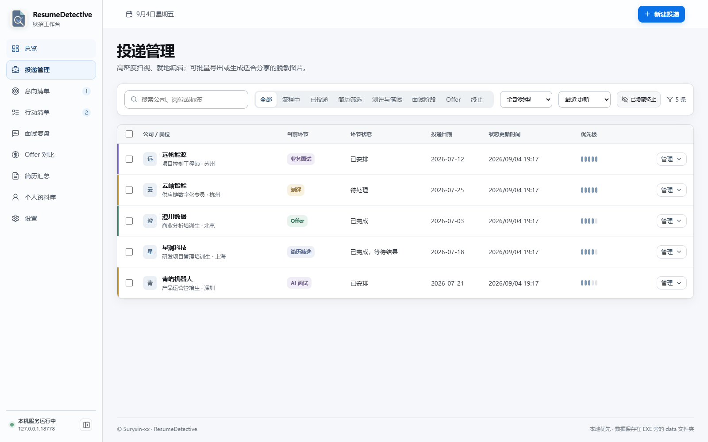
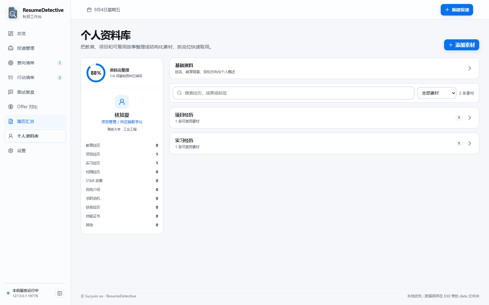

<div align="center">
  

  # ResumeDetective

  **本地优先的 Windows 求职进度工作台**

  把意向岗位、投递流转、待办、面试复盘、简历与 JD 收进一条清晰的求职主线。

  [](https://github.com/Suryxin-xx/ResumeDetective/releases)
  [](#下载与使用)
  [](go.mod)
  [](LICENSE)

  [下载最新版](https://github.com/Suryxin-xx/ResumeDetective/releases) · [功能一览](#功能一览) · [数据安全](#数据与安全) · [问题反馈](https://github.com/Suryxin-xx/ResumeDetective/issues)
</div>

<p align="center"></p>

## 为什么做这个工具

招聘网站负责投递，Excel 负责记结果，日历负责提醒，文件夹里放着不同版本的简历，面试问题又散落在笔记中。ResumeDetective 将这些信息围绕“一个岗位”关联起来，让你随时回答三个问题：

1. 这个岗位现在走到哪一步？
2. 下一步需要做什么？
3. 当时投了哪份简历，JD 和面试反馈是什么？

它不是自动投递器，也不是公网招聘平台。程序运行在你的 Windows 电脑上，核心数据默认只保存在 EXE 同级目录。

## 功能一览

| 模块 | 能做什么 |
| --- | --- |
| 投递管理 | 按招聘环节、状态、岗位类型、标签和关键词筛选；原位编辑并保留完整流转记录 |
| 总览与行动 | 聚合今日待办、进行中岗位、面试、Offer 和最近状态变化 |
| 意向岗位 | 先保存公司、岗位和 JD，准备好后可一键转为正式投递 |
| 简历与复盘 | 为每个岗位绑定简历，归档 JD，并记录每轮面试问题、结果与改进项 |
| 个人资料库 | 集中维护教育、项目、实习、校园和获奖经历，为定制简历与 AI 分析复用 |
| AI 辅助 | 可选 DeepSeek API 或 Reasonix CLI，用于 JD 匹配、简历建议和面试准备 |
| Excel 镜像 | 自动生成 `data/秋招投递追踪.xlsx`，无需打开软件也能快速查看与筛选 |
| 本地维护 | 托盘静默运行、登录自启、手动/定期备份、Python v3 数据迁移及 Release 更新 |

<table>
  <tr>
    <td width="50%"><strong>投递管理</strong></td>
    <td width="50%"><strong>个人资料与经历库</strong></td>
  </tr>
  <tr>
    <td></td>
    <td></td>
  </tr>
</table>

## 下载与使用

### 普通用户

1. 从 [GitHub Releases](https://github.com/Suryxin-xx/ResumeDetective/releases) 下载 `ResumeDetective-windows-x64.zip` 和同名 `.sha256` 文件。
2. 解压完整 ZIP 到有写入权限的文件夹，不要只复制其中的 EXE。
3. 双击 `ResumeDetective.exe`。程序会在后台启动，并打开固定的本机地址 `http://127.0.0.1:8765`。
4. 关闭浏览器不会退出服务；需要彻底退出时，请使用系统托盘菜单或设置页。

发布包内含一套完全虚构的演示数据，方便首次下载后直接了解完整流程。开始记录真实信息前，可在总览点击“清除演示数据”；该操作只处理带演示标记的记录。

> [!NOTE]
> 默认端口为 `8765`，可在设置中修改并在重启后生效。服务只监听 `127.0.0.1`，不会向局域网或公网开放。

> [!WARNING]
> 当前 Windows EXE 尚未进行商业代码签名，SmartScreen 可能显示“未知发布者”。请只从本仓库的 Releases 下载，并使用 `.sha256` 文件核对压缩包。

### SHA-256 校验

在下载目录打开 PowerShell：

```powershell
Get-FileHash .\ResumeDetective-windows-x64.zip -Algorithm SHA256
Get-Content .\ResumeDetective-windows-x64.zip.sha256
```

两处哈希值一致即可。

## 日常工作流

```text
意向岗位
   ↓ 一键转投递
已投递 → 简历筛选 → 测评 / AI 面试 / 笔试 → 业务面试 → HR 面 → Offer / 终止
   ├─ 关联当时使用的简历与 JD
   ├─ 生成或维护下一步行动
   └─ 每轮面试结束后记录复盘
```

新增、修改或删除投递，以及更新简历和面试记录后，程序会重新生成 Excel 镜像。SQLite 始终是唯一事实源，Excel 用于查看、筛选和备份，不建议直接回写。

## 数据与安全

```text
ResumeDetective.exe
data/
  resume_detective.db       # 主数据库
  秋招投递追踪.xlsx          # 自动生成的只读镜像
  config.json               # 本机设置
  .env                      # AI Key 等本机配置
  resumes/                  # 受管简历
  attachments/              # 岗位附件
backups/                    # 自动和手动备份
```

- 数据位于程序目录，便于整体迁移和备份；更新器只替换 EXE，不覆盖 `data`。
- `.gitignore`、提交前安全脚本和 GitHub Actions 会拦截数据库、简历、`.env`、备份与发布包。
- `.env` 用于避免密钥进入 Git，但它不是加密保险箱；请勿共享整个 `data` 目录。
- 删除受管简历或附件时优先进入系统回收站，降低误删风险。
- 修改类 HTTP 请求执行本机 Host、Origin 与请求体检查。
- 更新只接受固定 GitHub 仓库、HTTPS 下载地址和可验证的 Release 资产摘要。

建议在升级或批量导入前，先进入设置页执行一次“立即备份”。

## AI 配置

AI 功能完全可选，不配置也不影响投递管理、复盘、备份和 Excel 镜像。

### DeepSeek API

在“设置 → AI Provider”中选择 DeepSeek API，填写 API Key 并测试连接。Key 写入本机 `data/.env`，不会返回前端或写入应用日志。只有主动点击分析时，相关 JD、选定简历和资料库文本才会发送到 API；手机号、出生日期等字段不会加入默认上下文。

设置页支持手动查询账户余额，查询结果与时间不会写入数据库。

### Reasonix CLI

也可以从 [DeepSeek-Reasonix](https://github.com/esengine/DeepSeek-Reasonix) 自行下载 Reasonix，并在设置中选择其可执行文件。ResumeDetective 通过非交互 JSON 输出调用 CLI，不会将 Reasonix 二进制或其密钥打入本项目源码和发布包。

AI 输出只作为求职材料建议，请在使用前核对事实、措辞和经历真实性。

## 从 Python v3 迁移

当前 `main` 是 Go + React 版本。Python v3.3.1 源码完整保留在 [`main-python`](https://github.com/Suryxin-xx/ResumeDetective/tree/main-python) 分支。

v4 不会直接修改旧数据库。在设置页选择 Python 版数据目录后，一键导入会先建立备份，再复制并迁移数据库、简历和附件。建议迁移完成后同时保留旧目录与迁移前备份，确认使用稳定后再自行归档。

## 从源码运行

开发环境：Windows 10/11、Go 1.25+、MinGW GCC、Node.js 24+。

```powershell
git clone https://github.com/Suryxin-xx/ResumeDetective.git
cd ResumeDetective

npm --prefix frontend ci
npm --prefix frontend run build
go test ./...
go run ./cmd/resumedetective --data-dir .\local-artifacts\dev-data --no-browser
```

前端修改后需要重新执行 `npm --prefix frontend run build`，生成内容会嵌入 Go EXE。

### Windows 正式构建

```powershell
.\scripts\atuo.bat -Version 4.1.0
```

构建入口依次执行仓库安全扫描、React/TypeScript 构建、Go 测试、`go vet`、Windows GUI EXE 构建、版本资源写入、虚构演示库生成、ZIP 压缩和 SHA-256 生成。

同版本发布目录已存在时，`atuo.bat` 会在新包成功生成后将旧目录归档到 `releases/archive`。详细说明见 [PACKAGING.md](PACKAGING.md)。

## 分支说明

| 分支 | 用途 |
| --- | --- |
| `main` | 当前维护的 Go + React v4 主线 |
| `main-python` | Python v3.3.1 历史版本，只进行必要的存档维护 |

提交代码前建议运行：

```powershell
powershell -NoProfile -ExecutionPolicy Bypass -File .\scripts\check_repository_safety.ps1
git add -A
powershell -NoProfile -ExecutionPolicy Bypass -File .\scripts\check_repository_safety.ps1 -Staged
git diff --cached --check
```

## 配套工具

PDF 转换能力已拆分为独立项目，以减小 ResumeDetective 的体积和攻击面：

- [ImagePDFConverter](https://github.com/Suryxin-xx/ImagePDFConverter)：图片与 PDF 转换
- [Word_PDF2Image](https://github.com/Suryxin-xx/Word_PDF2Image)：Word/PDF 转图片

## 开发与致谢

- 开发者：[Suryxin-xx](https://github.com/Suryxin-xx) · [Finlandxxu@outlook.com](mailto:Finlandxxu@outlook.com)
- 项目地址：[Suryxin-xx/ResumeDetective](https://github.com/Suryxin-xx/ResumeDetective)
- ChatGPT/Codex 与 DeepSeek 参与需求分析、代码实现、调试和测试，最终取舍与发布由开发者人工负责。
- AI 接入参考并兼容 [esengine/DeepSeek-Reasonix](https://github.com/esengine/DeepSeek-Reasonix) 的 CLI 使用方式。
- Excel 镜像使用 [Excelize](https://github.com/xuri/excelize) 生成。
- 产品与网页交互参考了 [xuuuu-cpu/offerFlow-llm-feature](https://github.com/xuuuu-cpu/offerFlow-llm-feature) 的部分思路；代码为本项目独立重构。
- 视觉层级参考 [GitHub Primer](https://primer.style/) 与 [Microsoft Fluent 2](https://fluent2.microsoft.design/design-tokens) 的公开设计方法。

## License

本项目基于 [MIT License](LICENSE) 开源。如果它对你有帮助，欢迎 Star、提交 Issue 或参与改进。
